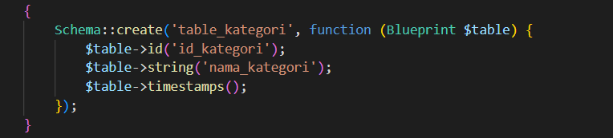
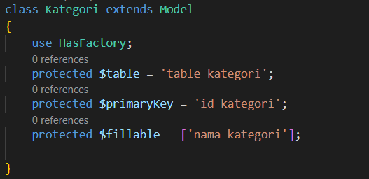
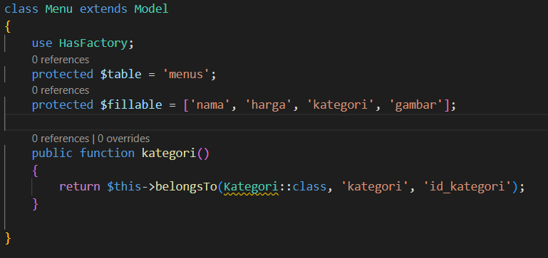
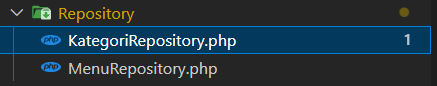
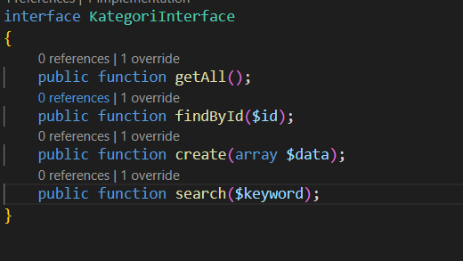
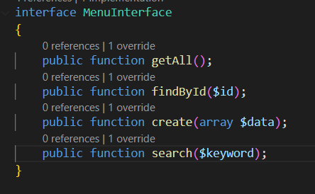
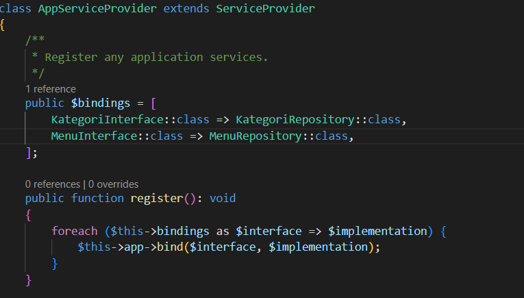
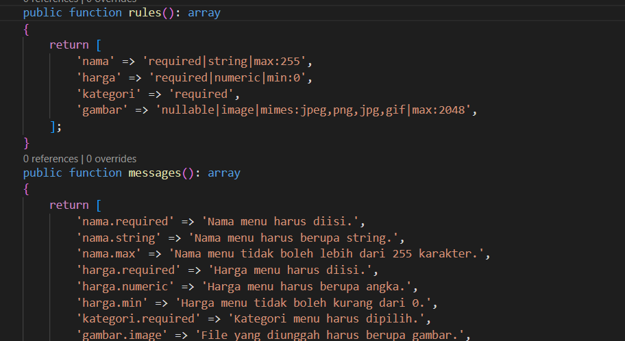
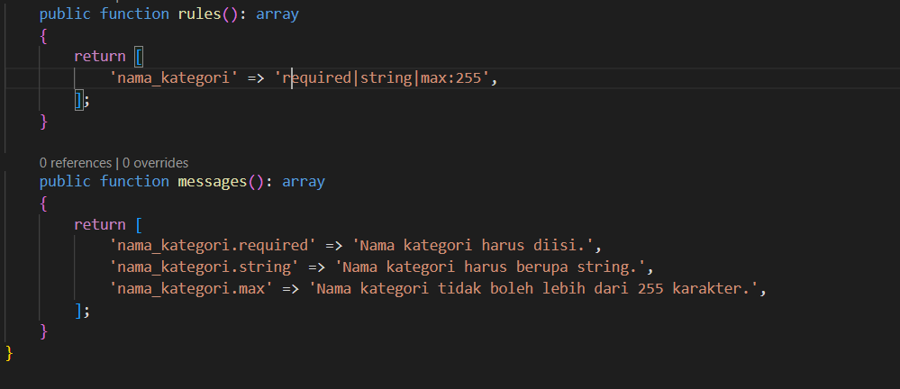

## Story (Mario POV)

Suatu pagi, aku di-chat oleh Raka lewat WhatsApp:

> "Mar, minta tolong dong benerin error ku ini. Padahal 1 minggu yang lalu aku udah testing, udah bener."

Dia juga mengirimkan screenshot error dan repository miliknya:
👉 https://github.com/Yohnzz/WarungMakanBuSari/tree/CodeRaka

Aku pun membalas:

> "Oke, aku cek dulu ya. Mungkin besok sudah selesai."

---

## Setup

Aku langsung clone repository milik Raka:

```bash
git clone https://github.com/Yohnzz/WarungMakanBuSari.git
```

Setelah itu, aku mulai testing dan hasilnya sama seperti yang dikirim oleh Raka — memang terdapat beberapa error.

---

## Analisis Masalah

Setelah aku cek, ternyata ada beberapa masalah pada struktur dan logic code:

### 🔧 Struktur Code

* Semua logic ditaruh di **Controller**, padahal seharusnya controller hanya mengatur response
* Tidak ada pemisahan layer seperti:

  * Repository
  * Interface
  * Request
  * Controller (yang proper)

---

### ❌ Problem 1: Store Data Tidak Masuk Database

Masalah utama:

* Tidak ada `$menu->save()` setelah assign data

Akibatnya:

* Response tetap sukses
* Tapi data **tidak pernah tersimpan ke database**

Kemungkinan penyebab:

* Raka hanya mengecek response (status sukses), tapi tidak cek database
* Saat minggu pertama, bug ini tidak terasa karena belum ada penambahan data oleh user

---

### ❌ Problem 2: Delete Data Error Panjang

Saat menghapus data yang tidak ada, muncul error panjang berwarna merah.

Penyebab:

* Tidak ada error handling ketika data tidak ditemukan

Contoh perbaikan:

```php
if(!$menu){
    return response()->json([
        'message' => 'Data menu yang dicari tidak ada'
    ]);
}
```

Kemungkinan:

* Raka lupa menambahkan validasi ini
* Bu Sari mencoba menghapus menu yang memang sudah tidak ada

---

## Solution

Setelah memahami semua error, aku mulai memperbaiki logic pada MenuController.

Hasilnya:

* Fitur **Store** sudah menyimpan data dengan benar
* Fitur **Delete** sudah aman dan tidak error lagi

---

## Refactor Code

Selain memperbaiki bug, aku juga merapikan struktur project agar lebih maintainable.

### 🗂️ Migration

* Menambahkan migration baru untuk kategori
* Menambahkan field gambar



---

### 🧩 Model

* Menambahkan model **Kategori**
* Memperbaiki model **Menu**




---

### 📦 Repository

* Membuat:

  * KategoriRepository
  * MenuRepository



---

### 🔌 Interface & Provider

* Membuat interface untuk masing-masing repository
* Menambahkan service provider





---

### 📥 Request Validation

* Membuat request validation untuk:

  * Menu
  * Kategori




---

# TO BE CONTINUE