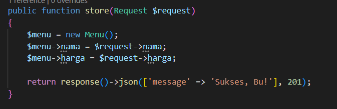
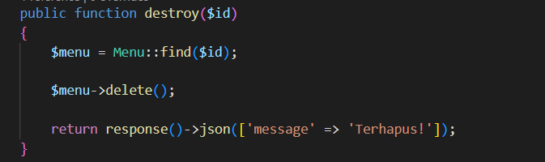
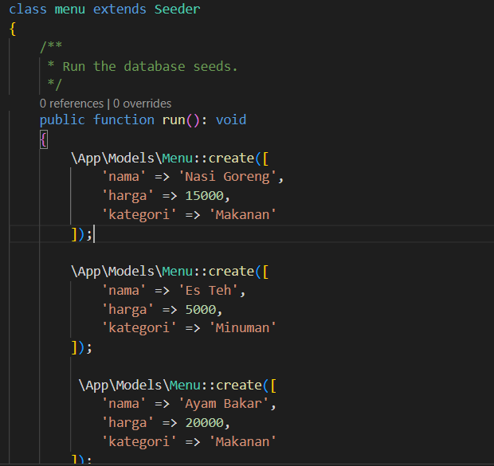
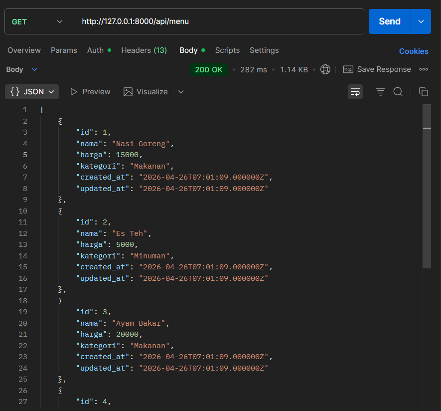
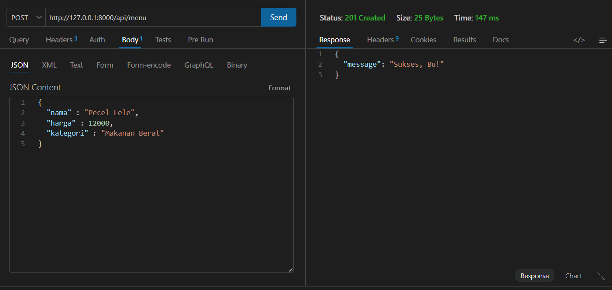
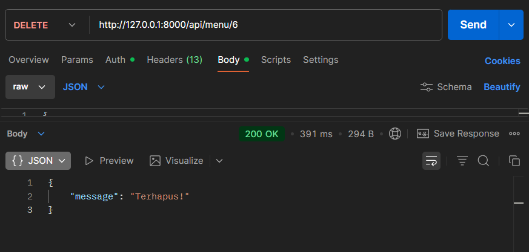
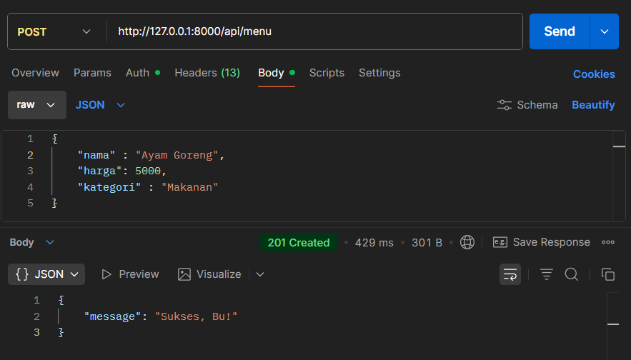
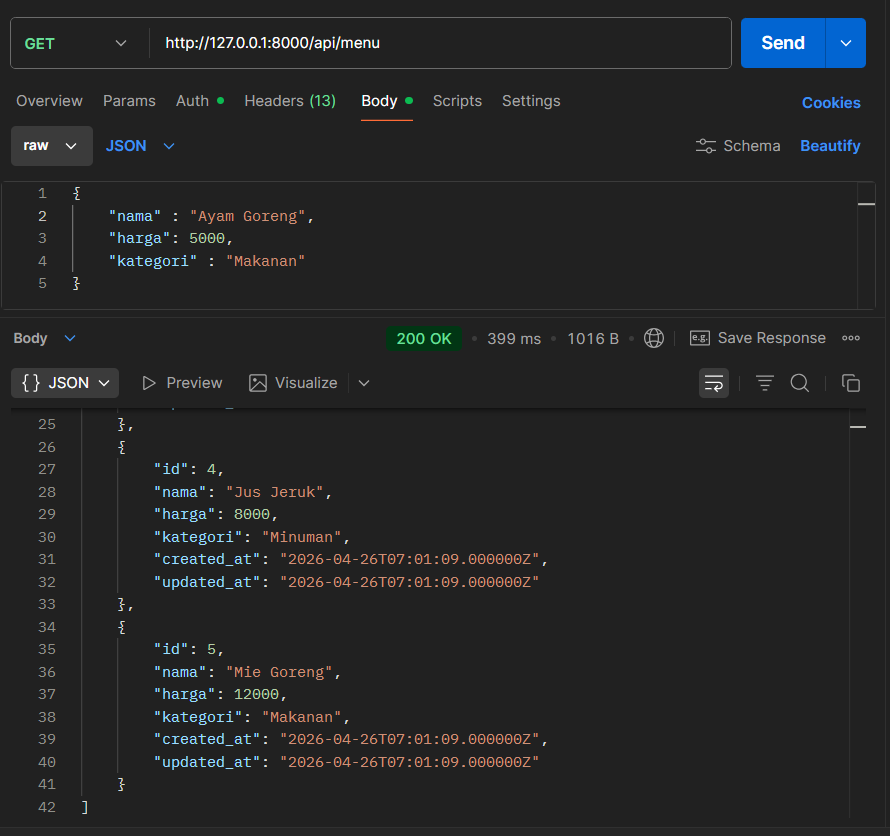
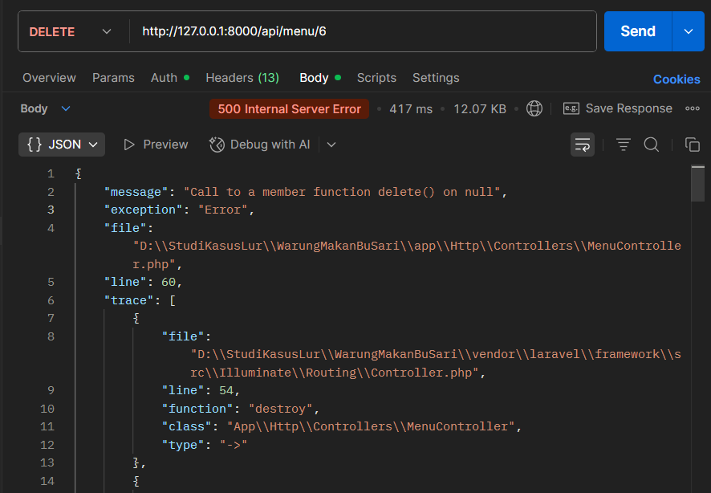

## Story

Aku Raka. Dalam 2 hari terakhir, aku membuat CRUD API sederhana untuk Warung Makan Bu Sari.  
Di project ini, aku mengimplementasikan beberapa fitur utama seperti:

* **Store**  

* **Delete**  

* **Data Seeder**  
  
Aku membuat seeder agar Bu Sari tidak perlu menambahkan menu secara manual di awal.

Aku cukup senang karena akhirnya bisa membuat project sederhana yang benar-benar bisa dipakai oleh Bu Sari.

### Response Server:

* **Get**  

* **Post**  

* **Delete**  

---

## Problem

Selang 1 minggu, aku menerima pesan dari Bu Sari:

> 🧓 “Nak, tadi aku coba tambah menu baru tapi kok nggak masuk ke daftar ya? Aku isi nama sama harganya, terus katanya sukses, tapi pas aku lihat menunya nggak ada.”

* **Post**  

* **Get**  

[MENJELASKAN BAHWA DATA AYAM GORENG TIDAK ADA WAKTU DI GET]

> 🧓 “Ini juga aneh — aku coba hapus menu ‘Es Teh’ yang sudah nggak ada, tapi malah aplikasinya error terus. Tulisannya panjang banget, merah semua.”

* **Delete**  

Aku langsung panik. Aku buka lagi laptop, cek satu per satu kodenya… tapi malah makin bingung.

Selama kurang lebih 3 jam aku mencoba mencari masalahnya, tapi tetap tidak menemukan solusi.

---

## Solution

Akhirnya aku memutuskan untuk meminta bantuan temanku, Mario, yang lebih paham Laravel.  
Aku minta dia untuk membantu mengecek dan memperbaiki kodinganku.

Setelah diperbaiki, dia memberikan versi repository yang sudah dibenarkan:

👉 https://github.com/Yohnzz/WarungMakanBuSari/tree/codemario

---

## Thanks

Aku sangat berterima kasih kepada Mario karena sudah membantu memperbaiki bug di project ini 🙌
